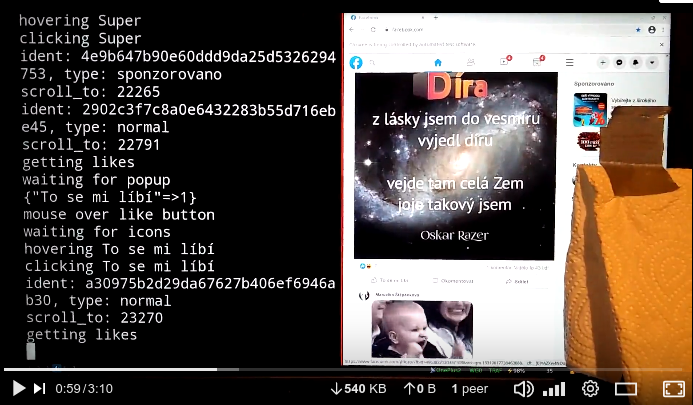

# facebook-rockin-best-automation-selenium-scrape-no-api-tool-bot-machine-made-to-destroy-facebook

Or simply "fb.rb" is an automation tool for webscraping the facebook.com.


## Features:

  - everything is scraped using Selenium, no API is used
  - visible/headless mode
  - login
  - get/cache friends
  - traverse timeline
  - give a like (also different types)
  - get number of likes
  - detect if a like has already been given
  - get number of shares
  - share a post on my timeline
  - get number of comments
  - comment a post

planned:

  - post something
  - delete a post (suicide mode)


## See it in action (video)

[](https://www.youtube.com/watch?v=hf0iS7koCPo "In Action!")


## Prerequisities

The library `fb.rb` works with chromium/chrome only at the moment. Selenium supports Firefox as well, if you like, you can commit an improvement.

Browser's window is expected to be 1000 pixels width and at least 1000 pixels height, zoomed 100%. In different sizes, the page looks differently and therefore the bot may not work.

Because the bot is searching for texts, language is important. English (US) and Czech are supported. 


## Installation step by step

1. install ruby

It may be already installed, just type "ruby -v" to check the version.

2. install chromium/chrome

3. install selenium

4. install selenium-webdriver gem (a ruby library)

```bash
$ gem install selenium-webdriver

```

5. clone this repo and chdir into it

```bash
$  git clone https://github.com/mig1984/facebook-rockin-best-automation-selenium-scrape-no-api-tool-bot-machine-made-to-destroy-facebook.git
$  cd facebook-rockin-best-automation-selenium-scrape-no-api-tool-bot-machine-made-to-destroy-facebook
```


## Howto

1. The `fb.rb` is the library and `bot.rb` is the robot. It is a working example. You may wish to change it completely. Still, you have to edit the `bot.rb` because there are lots of hardcoded things.

2. Run the bot in the DEVELOPMENT mode:

```bash
$ DEVELOPMENT=1 ruby bot.rb
D, [2021-02-27T14:57:52.857216 #28190] DEBUG -- : starting chrome
D, [2021-02-27T14:57:53.642585 #28190] DEBUG -- : chromium started
```

3. A browser window should appear and an irb console, too. Log into the facebook manually and set the browser to start in the last closed state (next time the bot won't need to log-in. There is also a 'login' method, but I don't use it since I do it like this).

4. Remember that the window size is important, especially it's width. Make it 1000x1000 and set zoom to 100%.

5. Now try to load friends. On the irb development console type:

```irb
irb(main):001:0> fb.friends
I, [2021-02-27T14:59:33.522214 #28190]  INFO -- : loading friends...
D, [2021-02-27T14:59:35.098771 #28190] DEBUG -- : loading anchors...
D, [2021-02-27T14:59:35.810020 #28190] DEBUG -- : scroll_to_bottom
D, [2021-02-27T14:59:35.832218 #28190] DEBUG -- : scroll_to: 2228
D, [2021-02-27T14:59:37.861725 #28190] DEBUG -- : loading anchors...
D, [2021-02-27T14:59:39.154125 #28190] DEBUG -- : scroll_to_bottom
D, [2021-02-27T14:59:39.157675 #28190] DEBUG -- : scroll_to: 4212
D, [2021-02-27T14:59:41.165744 #28190] DEBUG -- : loading anchors...
D, [2021-02-27T14:59:43.364750 #28190] DEBUG -- : scroll_to_bottom
D, [2021-02-27T14:59:43.367785 #28190] DEBUG -- : scroll_to: 6192
D, [2021-02-27T14:59:45.377527 #28190] DEBUG -- : loading anchors...
=> ["aaaa", "bbbbb", "ccccc", "dddd", ....... ]
```

If this works, everything else will probably work.

A file firends.yaml should appear in the current directory. It works as a cache. Delete the file to force an update next time.

6. Try to get 2 posts.

```irb
irb(main):002:0> posts = fb.timeline(2)
D, [2021-02-27T15:01:33.220230 #28190] DEBUG -- : loading homepage
I, [2021-02-27T15:01:35.162439 #28190]  INFO -- : traversing the timeline...
I, [2021-02-27T15:01:35.972156 #28190]  INFO -- : feed unit: ident=9439123d2ff06357ac7aa7654d77b4ac, type=normal
D, [2021-02-27T15:01:36.003776 #28190] DEBUG -- : scroll_to: 511
I, [2021-02-27T15:01:40.711514 #28190]  INFO -- : feed unit: ident=66d9a73154e00bd28adee7ce274339c2, type=sponsored
D, [2021-02-27T15:01:40.716863 #28190] DEBUG -- : scroll_to: 1495
=> [#<struct FB::FeedUnit el=#<Selenium::WebDriver::Element:0x72d240308599784e id="adc8a930-ddf7-4cfc-a72f-b07b891a56cb">, type=:normal, ident="9439123d2ff06357ac7aa7654d77b4ac", header="Michal SperlingMichal Sperling">, #<struct FB::FeedUnit el=#<Selenium::WebDriver::Element:0x609931b4682c7d8a id="d4d29503-9605-4387-b12f-160a72fdb492">, type=:sponsored, ident="66d9a73154e00bd28adee7ce274339c2", header="Alza.cz Alza.cz Sponsored\n  ·Sponsored\n  ·">]
```

7. Like the first post (fu; feed unit).

```irb
irb(main):005:0> fu = posts.first
=> #<struct FB::FeedUnit el=#<Selenium::WebDriver::Element:0x2f18ecc8d800d3f6 id="e3509cf...
irb(main):006:0> fb.like fu
I, [2021-02-27T15:04:35.952951 #28190]  INFO -- : like...
D, [2021-02-27T15:04:35.953062 #28190] DEBUG -- : getting likes...
D, [2021-02-27T15:04:36.285573 #28190] DEBUG -- : - waiting for a popup
D, [2021-02-27T15:04:38.657369 #28190] DEBUG -- : {"Like"=>1}
D, [2021-02-27T15:04:38.670173 #28190] DEBUG -- : - hovering the button
D, [2021-02-27T15:04:38.963086 #28190] DEBUG -- : - waiting for icons
D, [2021-02-27T15:04:41.487540 #28190] DEBUG -- : - hovering Like
D, [2021-02-27T15:04:42.802933 #28190] DEBUG -- : - clicking Like
=> true
```

8. Write a comment.

```irb
irb(main):006:0> fb.comment fu, "I love this!"
I, [2021-02-27T15:09:18.443871 #28190]  INFO -- : comments...
D, [2021-02-27T15:09:19.241379 #28190] DEBUG -- : - entering text: I love this!
=> nil
```

9. Share the post.

```irb
irb(main):006:0> fb.share fu
I, [2021-02-27T15:11:12.078970 #28190]  INFO -- : sharing...
D, [2021-02-27T15:11:12.249579 #28190] DEBUG -- : - on my own timeline
=> nil
```

10. Get number of shares of the post.

```irb
irb(main):006:0> fb.shares fu
=> 5
```

11. Finally type CTRL-D (or CTRL-C) to exit from the irb console and start the automatic process in the shell:

```bash
$ ruby bot.rb
```

or headless

```bash
$ HEADLESS=1 ruby bot.rb
```


## Debugging and adding features

1. Start the bot with the environment variable DEVELOPMENT set. In the shell, type:

```bash
$ DEVELOPMENT=1 ruby bot.rb
```

2. An irb console and a browser window should appear. You are in the main context of bot.rb now. There is an instance of the FB class called 'fb'.

3. Now you can call the `process_timeline(fb)` method to traverse through the timeline as the bot normally does, or call any `fb.*` method which you find in the FB class.

Example:

```ruby
posts = fb.timeline(2)  # get up to 2 posts (feed units)
```

(type `posts.inpsect` to see the content of the array).

Look into the FB class and the `comment` method. There is a line

```ruby
button = elmw ".//div[@aria-label='#{COMMENTS_BUTTON_LABEL}']", fu.el
```

Mabye there is a problem. So try the line on the console. Either prefix everything with fb and FB (because the console's context is the main context),

```ruby
posts = fb.timeline(2)
fu = posts.first  # fu means feed unit
button = fb.elmw ".//div[@aria-label='#{FB::COMMENTS_BUTTON_LABEL}']", fu.el
```

Or, better, start an inherited irb console in the context of the instance,

```ruby
fb.debug  # start the inherited console
posts = timeline(2)
fu = posts.first  # fu means feed unit
button = elmw ".//div[@aria-label='#{COMMENTS_BUTTON_LABEL}']", fu.el
```

Easy.

If you want to modify the FB instance on-the-fly, ruby allows this. Just re-define a method on the commandline:

```irb
irb(#<FB:0x0000563e6d41d578>):016:1* class FB
irb(#<FB:0x0000563e6d41d578>):017:2*   def comment
irb(#<FB:0x0000563e6d41d578>):018:2*     'new content'
irb(#<FB:0x0000563e6d41d578>):019:1*   end
irb(#<FB:0x0000563e6d41d578>):020:0> end
=> :comment
```

Adding new methods to an existing instance works the same way.

When you are done, don't forget to modify the file :-)


Enjoy!